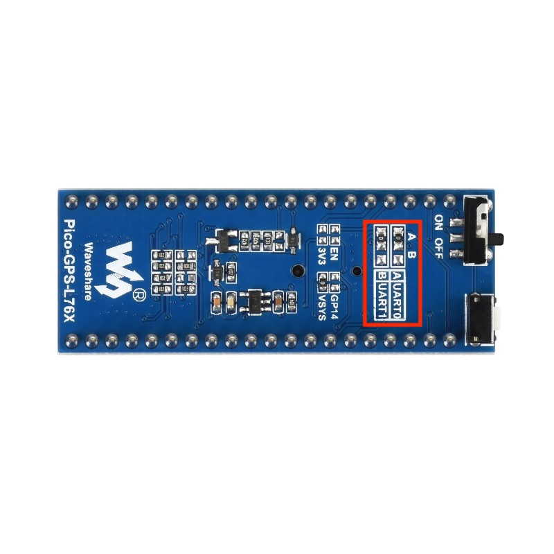

# Clock 2

## GPS-Disciplined Stratum-1 NTP Server

> **A compact Power-over-Ethernet GPS-disciplined Stratum-1 NTP
> appliance built around the ESP32-S3.**

**PHOTO PLACEHOLDER:** Hero image of completed Clock 2

------------------------------------------------------------------------

# Introduction

Clock 2 is a self-contained Stratum-1 NTP server that disciplines an
ESP32-S3 using the 1 PPS output from a GNSS receiver and serves accurate
time over Ethernet.

It combines GPS/PPS disciplined timing, a standards-compliant NTP
server, an embedded web interface, REST API, health endpoint, persistent
configuration, and a front-panel OLED into a compact network appliance.

# Features

-   GPS disciplined UTC
-   PPS synchronization
-   Stratum-1 NTP
-   W5500 Ethernet + PoE
-   DHCP
-   mDNS (`clock2.local`)
-   Embedded Web UI
-   REST JSON API
-   `/health` endpoint
-   Persistent hostname configuration
-   SH1107 128×64 OLED
-   Four rotating OLED pages
-   Physical buttons

# Hardware

Clock 2 intentionally uses **three commercially available Waveshare
modules** plus an active GPS antenna.

No custom PCB is required.

  ----------------------------------------------------------------------------------------------
  Module                  Purpose                 Documentation
  ----------------------- ----------------------- ----------------------------------------------
  ESP32-S3-ETH (PoE)      Main processor,         https://www.waveshare.com/wiki/ESP32-S3-ETH
                          Ethernet, PoE           

  Pico-GPS-L76B           GNSS receiver with      https://www.waveshare.com/wiki/Pico-GPS-L76B
                          UART + PPS              

  Pico-OLED-1.3           SH1107 128×64 OLED      https://www.waveshare.com/wiki/Pico-OLED-1.3
  ----------------------------------------------------------------------------------------------

## Required GPS Modifications

Required Modifications to the Pico-GPS-L76B
The Waveshare Pico-GPS-L76B is designed to be used with multiple host platforms. In its factory configuration, the UART and PPS signals are routed to the default Pico pin assignments.
Clock 2 uses the Waveshare ESP32-S3-ETH board instead of a Raspberry Pi Pico, so the GPS module must be reconfigured to route those signals to the ESP32-S3 pins used by the firmware.
These are one-time hardware modifications.
H1 and H2 – Route the UART
The Pico-GPS-L76B contains two solder jumpers, H1 and H2, that determine where the GPS receiver's UART is routed.
From the factory, both jumpers are in the A position.
Move:
H1: A → B
H2: A → B
This reroutes the GPS receiver's TX and RX signals from the default Pico UART pins to the alternate UART pins connected to the ESP32-S3-ETH expansion header.
The Clock 2 firmware expects the GPS receiver to appear on these alternate pins. If H1 and H2 remain in the factory position, the ESP32-S3 will not receive any NMEA data.
Development Note: During development, an intermittent loss of GPS communication was eventually traced to a poor solder joint on H2. If the firmware reports no NMEA sentences despite the GPS appearing to operate normally, verify continuity across H2.

[](docs/images/L76K-before-H1H2.jpg)


### Close R20

[](docs/images/L76K-before-R20.jpg)

R20 – Enable the PPS Signal
The L76K GPS receiver generates an accurate 1 Pulse Per Second (1 PPS) timing signal that is used to discipline the Clock 2 timebase.
On the Pico-GPS-L76B, this signal is not connected to the expansion header by default.
Close solder bridge R20 to route the PPS output to the expansion connector.
Without this modification:
GPS position data is available.
NMEA sentences are received normally.
PPS is unavailable.
Without PPS, Clock 2 cannot operate as a GPS-disciplined Stratum-1 NTP server. It would function only as an ordinary GPS clock.


## Hardware Assembly

**PHOTO PLACEHOLDER:** Front

**PHOTO PLACEHOLDER:** Side

**PHOTO PLACEHOLDER:** Rear

The OLED uses SPI3 while the W5500 Ethernet controller remains on SPI2.

# Software Architecture

``` text
GPS
 │
UART + PPS
 │
Time Association
 │
Timebase Discipline
 │
NTP Server
 ├── REST API
 ├── Web Interface
 └── OLED Front Panel
```

Timing-critical functions remain isolated from the user interface.

# Embedded Web Interface

Pages:

-   Main
-   Diagnostics
-   Settings

**SCREENSHOT PLACEHOLDER:** Main

**SCREENSHOT PLACEHOLDER:** Diagnostics

**SCREENSHOT PLACEHOLDER:** Settings

# OLED Front Panel

Pages:

-   Clock
-   GPS
-   Network
-   NTP/System

Buttons:

-   KEY0 --- Bright → Dim → Off
-   KEY1 --- Pause / Resume

**PHOTO PLACEHOLDER:** OLED pages

# REST API

`GET /api/status`

# Health Endpoint

`GET /health`

Returns HTTP 200 only when synchronized, otherwise HTTP 503.

# Performance

Typical Chrony synchronization is within a few microseconds.

**SCREENSHOT PLACEHOLDER:** chronyc sources

**SCREENSHOT PLACEHOLDER:** chronyc tracking

# Building

``` bash
idf.py build
idf.py flash
idf.py monitor
```

# Design Philosophy

Clock 2 is designed as an appliance rather than a demonstration project.

The PPS interrupt, GNSS association logic, disciplined timebase, and NTP
timestamp generation are intentionally isolated from the OLED, Web UI,
REST API, and configuration pages.

# Builder's Notes

-   Move H1 and H2 from A → B.
-   Close R20 to enable PPS.
-   Verify H2 continuity if GPS UART stops unexpectedly.
-   OLED runs on SPI3 while Ethernet remains on SPI2.
-   Install a GPS backup battery to reduce cold-start acquisition time.

# Development Journey

**PHOTO PLACEHOLDER:** Prototype

**PHOTO PLACEHOLDER:** First GPS lock

**PHOTO PLACEHOLDER:** Web UI milestone

**PHOTO PLACEHOLDER:** OLED bring-up

**PHOTO PLACEHOLDER:** Final appliance

# Future Enhancements

-   GPS antenna icon
-   Optional six-digit display
-   3D printed enclosure
-   Prometheus metrics
-   SNMP support

# Version History

  Version   Description
  --------- ------------------------------------------
  v0.1.0    Initial GPS-disciplined Stratum-1 server
  v0.2.0    Embedded web interface
  v0.2.1    Web interface polish
  v0.3.0    Persistent hostname configuration
  v0.4.0    Landscape OLED interface
