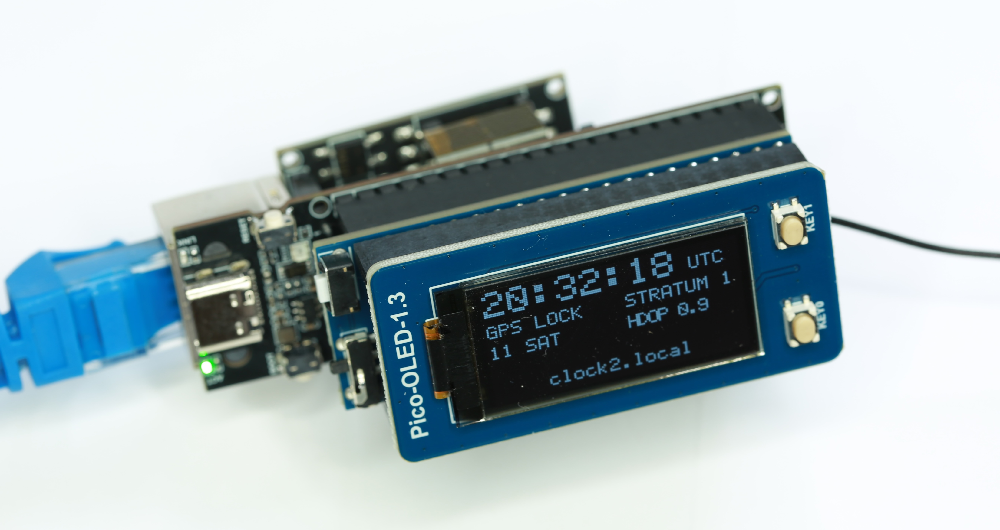
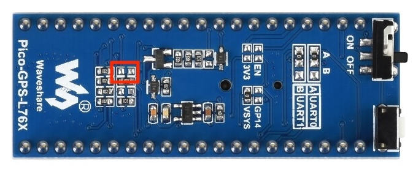
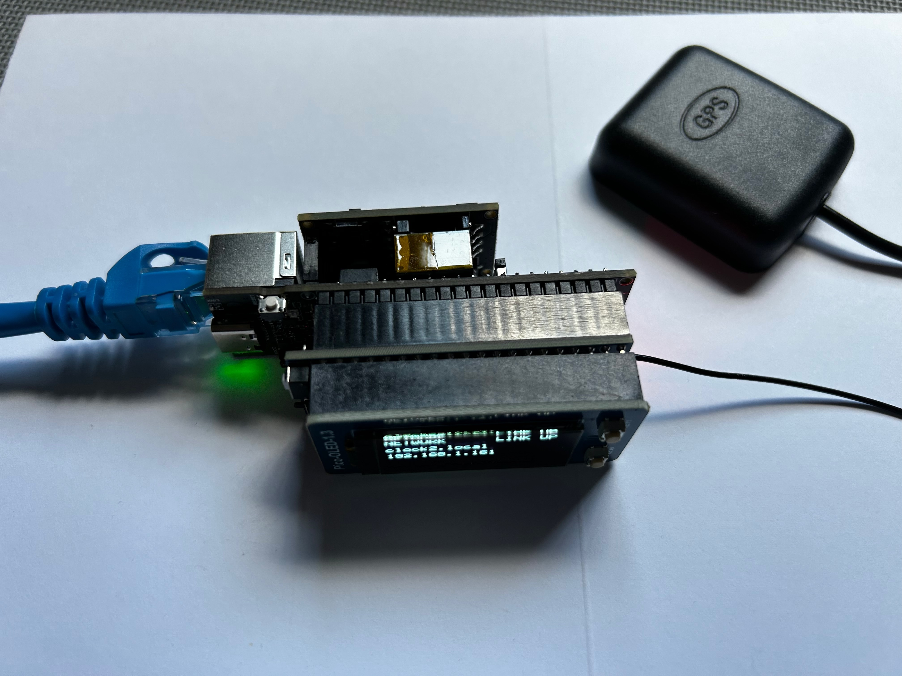
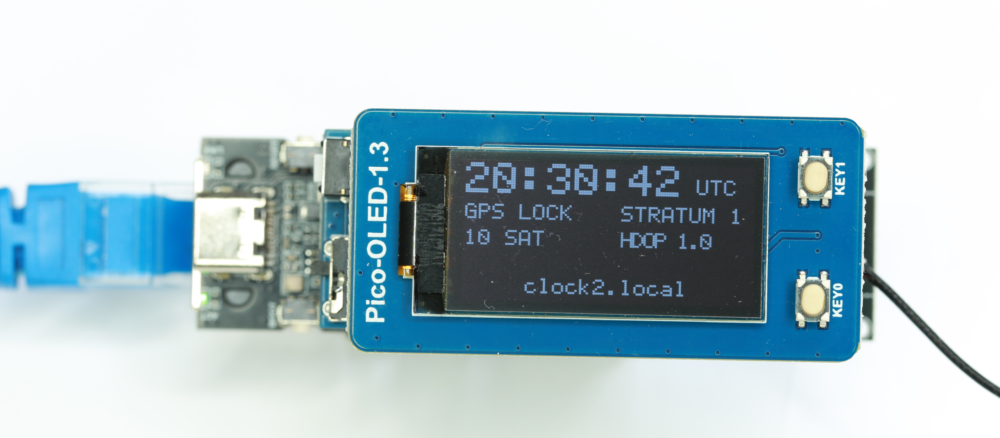
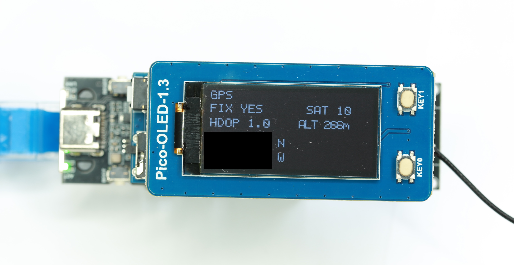
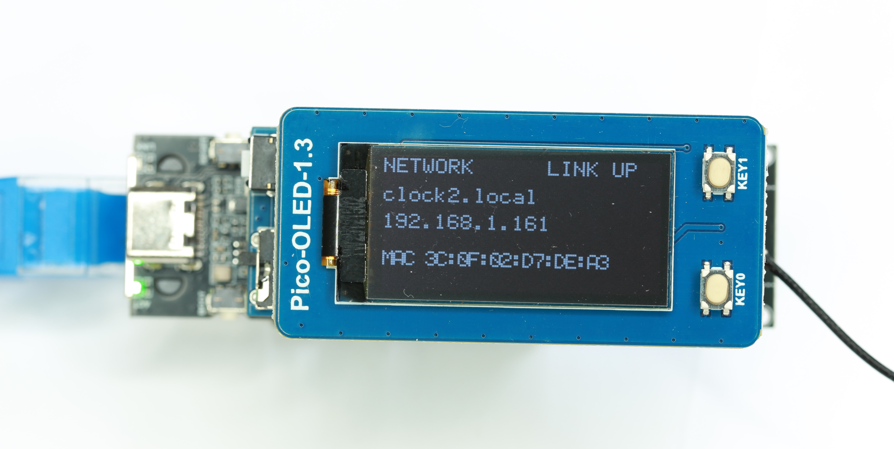
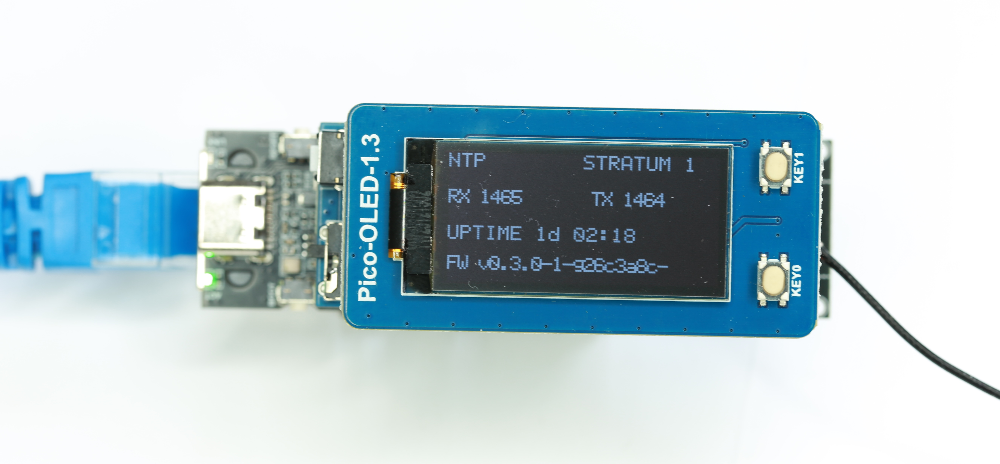
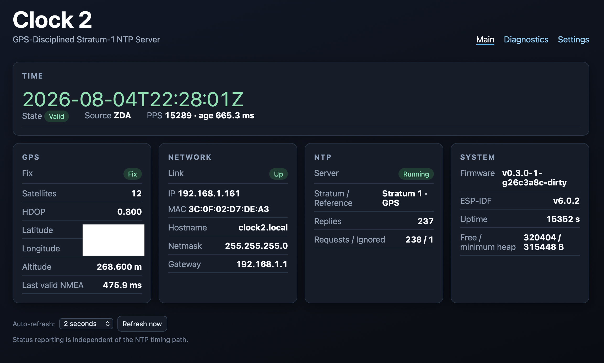
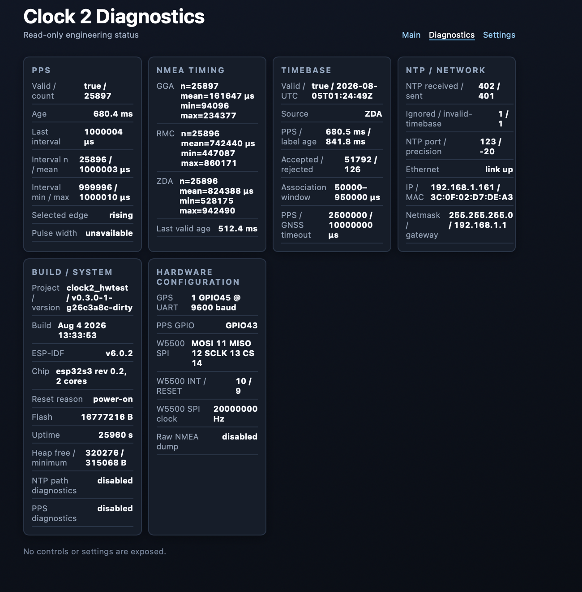
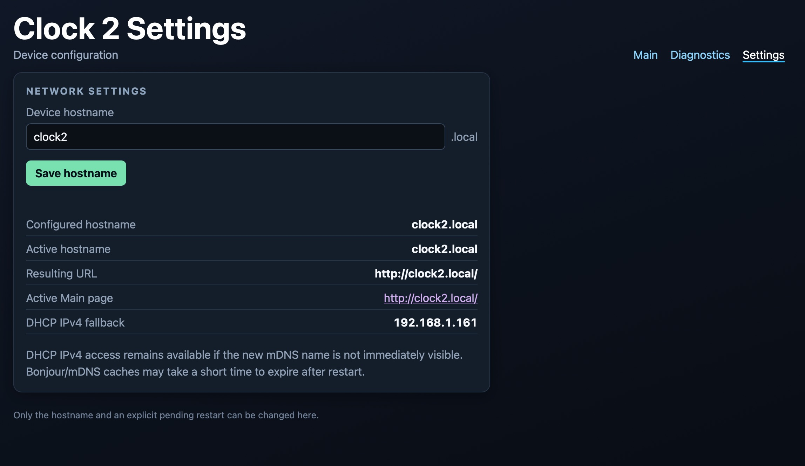

# Clock 2

**A compact, PoE-powered, GNSS-disciplined Stratum 1 NTP appliance built around the ESP32-S3.**



Clock 2 combines a GNSS receiver's UTC labels with its separate 1 PPS signal, maintains a validated UTC timebase, and serves that time over a wired W5500 Ethernet connection. The appliance uses three stacked Waveshare modules: an ESP32-S3 Ethernet board, a GNSS board, and a landscape SH1107 OLED front panel. A self-contained web interface provides status, diagnostics, and hostname configuration.

## At a glance

- Minimal NTPv4 server on UDP port 123, reporting Stratum 1 with reference ID `GPS`
- PPS-anchored UTC timebase derived from checksum-valid RMC/ZDA sentences
- W5500 10/100 Ethernet with DHCP, PoE power, and mDNS discovery
- Default hostname `clock2.local`, configurable in browser and persisted in NVS
- Four-page 128×64 OLED status interface with two physical controls
- Responsive, dependency-free web UI plus a JSON status API and health endpoint
- NMEA-to-PPS, PPS interval, NTP packet, and system diagnostics
- ESP-IDF 6.0.2, ESP32-S3 target, USB Serial/JTAG console, and 16 MB flash configuration

## Contents

- [Hardware](#hardware)
- [Required GPS board modifications](#required-gps-board-modifications)
- [Assembly](#assembly)
- [GPIO and bus assignments](#gpio-and-bus-assignments)
- [How it works](#how-it-works)
- [OLED front panel](#oled-front-panel)
- [Web interface](#web-interface)
- [REST API](#rest-api)
- [Health endpoint](#health-endpoint)
- [Build and flash](#build-and-flash)
- [First-boot verification](#first-boot-verification)
- [Measured performance](#measured-performance)
- [Host-side tests](#host-side-tests)
- [Design philosophy](#design-philosophy)
- [Version history](#version-history)

## Hardware

No custom carrier PCB is required. The modules use the shared Pico-compatible 40-pin header; the OLED stacks directly onto it. The GNSS board needs the one-time solder configuration described below, and an external active GNSS antenna needs a clear view of the sky. PoE supplies normal power to the complete appliance.

| Part | Role | Reference |
| --- | --- | --- |
| Waveshare ESP32-S3-ETH with external PoE Module (B) | ESP32-S3 processor, W5500 Ethernet, and appliance power; the base board accepts the separate IEEE 802.3af PoE module | [Waveshare ESP32-S3-ETH wiki](https://www.waveshare.com/wiki/ESP32-S3-ETH) |
| Waveshare Pico-GPS-L76B | GNSS receiver, NMEA UART, and 1 PPS source | [Waveshare Pico-GPS-L76B wiki](https://www.waveshare.com/wiki/Pico-GPS-L76B) |
| Waveshare Pico-OLED-1.3 | SH1107 OLED and KEY0/KEY1 controls | [Waveshare Pico-OLED-1.3 wiki](https://www.waveshare.com/wiki/Pico-OLED-1.3) |
| External active GNSS antenna | Satellite reception; required for the assembled appliance | Connect to the GNSS board's antenna socket |
| ML1220-compatible rechargeable backup cell | Optional; retains GNSS ephemeris/state across complete power loss for faster hot starts | See the GPS board documentation |

> **GPS naming note:** The verified Waveshare product and wiki name is **Pico-GPS-L76B**, and the board family is silkscreened `Pico-GPS-L76X`. Some project source comments, log text, and photo filenames use the earlier `L76K` label. This guide uses the official product name and does not infer a different receiver identity from those legacy labels.

The optional backup cell powers only the GNSS backup domain. It does not run Clock 2, Ethernet, or the display when PoE power is absent.

## Required GPS board modifications

The Pico-GPS-L76B supports two UART routes. Clock 2 uses the alternate route exposed on Pico GP4/GP5, because that route reaches the required pins in this ESP32-S3 stack. H1 and H2 select the route; R20 independently connects the receiver's PPS output to the expansion header.

These changes are required before final assembly.

### Move H1 from A to B

Remove the factory solder bridge from H1 position **A** and bridge position **B**.

### Move H2 from A to B

Remove the factory solder bridge from H2 position **A** and bridge position **B**. Together, H1 and H2 reroute the receiver UART TX/RX signals to the alternate pins used by Clock 2. The firmware currently needs only the receiver-to-ESP32 direction: GPS TX through Pico GP5 to ESP32-S3 GPIO45.

> **Verify both solder joints with continuity testing.** During development, an intermittent loss of all NMEA reception was traced to a poor H2 joint while PPS continued on its separate path.


*Factory-state H1/H2 area before rerouting; the red outline identifies the jumper locations. Both jumpers must finish in position B.*

<!-- TODO: Add photo of H1/H2 in B position -->

### Close R20 to enable PPS

Bridge R20 to route the receiver's 1 PPS signal through Pico GP16 to ESP32-S3 GPIO43. NMEA position and UTC sentences can still arrive without R20, but Clock 2 requires the separate PPS edge as its authoritative integer-second boundary. Without PPS, the firmware cannot provide its intended GNSS-disciplined Stratum 1 service.



*Factory-state R20 area before the PPS bridge is closed; the red outline identifies the modification location.*

<!-- TODO: Add photo of closed R20 -->
<!-- TODO: Add photo of completed GPS board -->

## Assembly

With power disconnected:

1. Complete and continuity-test H1, H2, and R20 on the GPS board.
2. Align the ESP32-S3-ETH, Pico-GPS-L76B, and Pico-OLED-1.3 on their Pico-compatible headers. Check pin 1 orientation on every layer before applying pressure.
3. Connect the active GNSS antenna and place its active face toward an unobstructed view of the sky.
4. Connect the Ethernet/PoE cable. Use USB only when flashing or monitoring the USB Serial/JTAG console.



*The three-module stack and external active antenna used by Clock 2.*

<!-- TODO: Add finished hero image if the enclosure changes -->
<!-- TODO: Add dedicated front view -->
<!-- TODO: Add dedicated side view -->
<!-- TODO: Add dedicated rear view -->
<!-- TODO: Add final antenna-placement photo -->

## GPIO and bus assignments

The mappings below are taken from the current source. Do not substitute arbitrary GPIOs when using the stacked Waveshare hardware.

### GNSS

| Function | Pico signal | ESP32-S3 | Configuration |
| --- | --- | --- | --- |
| NMEA receive | GP5 / GPS TX | GPIO45 | UART1, 9600 baud, 8N1 |
| PPS | GP16 / PPS through R20 | GPIO43 | Rising-edge interrupt |

GNSS transmit from the ESP32 is not used. The console is on USB Serial/JTAG, leaving GPIO43 available for PPS.

### W5500 Ethernet

| Function | ESP32-S3 GPIO |
| --- | ---: |
| MOSI | 11 |
| MISO | 12 |
| SCLK | 13 |
| CS | 14 |
| INT | 10 |
| Reset | 9 |
| SPI host | SPI2_HOST |
| SPI clock | 20 MHz |

### SH1107 OLED and keys

| Function | Pico signal | ESP32-S3 GPIO |
| --- | --- | ---: |
| MOSI / DIN | GP11 | 37 |
| SCLK / CLK | GP10 | 38 |
| CS | GP9 | 39 |
| D/C | GP8 | 40 |
| Reset | GP12 | 36 |
| KEY0 | GP15 | 33 |
| KEY1 | GP17 | 44 |
| SPI host | — | SPI3_HOST |

The OLED uses a dedicated SPI3 bus at 4 MHz, mode 3. Ethernet stays on SPI2, so the two devices do not reinitialize or share a physical SPI host.

## How it works

NMEA and PPS have separate jobs. NMEA RMC/ZDA sentences provide the UTC date and second label. The rising PPS edge provides the authoritative start of that integer second.

```text
Pico-GPS-L76B
  ├─ UART: checksum-valid RMC/ZDA UTC label ─┐
  └─ GPIO43: rising 1 PPS edge ──────────────┤
                                             ▼
                                 PPS/UTC association
                                   (50–950 ms window)
                                             │
                                             ▼
                                  Validated UTC timebase
                                             │
                            ┌────────────────┴───────────────┐
                            ▼                                ▼
                 timing-critical NTP path          presentation/status
                    W5500 UDP port 123             OLED · Web · JSON API
```

For this receiver's observed output order, an RMC or ZDA label refers to the most recent PPS edge. Firmware validates the NMEA checksum, date/time fields, RMC status, and a 50–950 ms PPS association window before accepting that label. ZDA is preferred when available; valid RMC is the fallback.

Once anchored, the timebase advances from subsequent PPS counts. A malformed or inconsistent sentence is rejected without destroying a good anchor. The timebase becomes invalid if the latest PPS is more than 2.5 seconds old or no accepted GNSS label has arrived for more than 10 seconds. The NTP server ignores requests while the timebase is invalid rather than serving stale or unsynchronized time.

OLED rendering, HTTP requests, JSON generation, and configuration storage read snapshots outside the PPS ISR and NTP timestamp callbacks.

## OLED front panel

The Waveshare panel is physically 64×128, backed by the SH1107's 128×128 RAM. Clock 2 rotates it into a logical **128×64 landscape** interface. A low-priority presentation task redraws once per second and automatically changes pages every eight seconds.

| Page | Contents |
| --- | --- |
| Clock | UTC, time validity, Stratum 1/NTP state, GNSS fix, satellites, HDOP, and hostname/link state |
| GPS | Fix, satellites, HDOP, altitude, latitude, and longitude |
| Network | Link state, active hostname, DHCP IPv4 address, and MAC address |
| NTP/System | NTP state/stratum, receive and transmit counters, uptime, and firmware version |

KEY0 cycles **100% → 35% → display off → 100%**. KEY1 pauses or resumes automatic page rotation. These choices are runtime-only and reset to their defaults after reboot.

OLED initialization is nonfatal: GPS, PPS, the UTC timebase, NTP, Ethernet, mDNS, and the web server continue if the display cannot start. Display work is presentation-only and does not change NTP timestamp generation.

| Clock | GPS |
| --- | --- |
|  |  |
| Network | NTP/System |
|  |  |

<!-- TODO: Replace OLED photographs if a final enclosure changes the viewing angle -->

## Web interface

All assets are compiled into the firmware: no JavaScript library, CSS framework, CDN, or internet connection is required.

| Route | Purpose |
| --- | --- |
| `GET /` | Main status dashboard: UTC, GNSS, network, NTP, and system overview |
| `GET /diagnostics` | Read-only PPS, NMEA timing, timebase, network, build, and hardware details |
| `GET /settings` | Persistent hostname configuration and explicit restart control |
| `GET /advanced` | Compatibility redirect (`302`) to `/diagnostics` |
| `GET /api/status` | Complete JSON status document |
| `POST /api/settings/hostname` | Save a validated hostname to NVS |
| `POST /api/settings/restart` | Restart only when a hostname change is pending |
| `GET /health` | Plain-text service readiness check |

The Main page refreshes immediately on load, then defaults to every 15 seconds. Its Auto-refresh selector offers Off, 2, 5, 15, 30, and 60 seconds; the selection is stored per browser under localStorage key `clock2.main.refreshSeconds`. “Refresh now” works even with automatic refresh off, and the client avoids overlapping `/api/status` requests. The Diagnostics page refreshes every two seconds.

The Settings page accepts a 1–63 character hostname containing letters, digits, and internal hyphens; it normalizes letters to lowercase. The configured name is saved in ESP32 NVS, while the active hostname remains unchanged until an explicit restart. If mDNS is unavailable or a renamed `.local` record has not propagated, use the DHCP IPv4 address shown on the OLED or in the console.

> The settings endpoints are intentionally unauthenticated and intended for a trusted LAN.







<!-- TODO: Refresh web screenshots when the UI changes materially -->

## REST API

Read the live snapshot with:

```bash
curl --fail --silent http://clock2.local/api/status | jq
```

The response has eight top-level groups:

| Group | Important fields |
| --- | --- |
| `time` | `valid`, ISO-8601 `utc`, source, PPS count/age, GNSS label age, accepted/rejected associations |
| `gps` | Fix and position validity, satellites, HDOP, coordinates, altitude, last-valid age, GGA/RMC/ZDA timing statistics |
| `network` | Running/link state, active and configured hostnames, restart-pending state, IP, MAC, netmask, gateway |
| `ntp` | Running state, port, stratum, precision, reference ID, received/transmitted/ignored counters |
| `pps` | Validity, count, edge age, interval statistics, selected edge, optional pulse width |
| `system` | Uptime, heap, firmware/project/ESP-IDF/build identity, chip, reset reason, flash size |
| `diagnostics` / `config` | Compile-time diagnostic states and the active UART, GPIO, SPI, association-window, and timeout constants |

Representative abbreviated output (values are from one hardware run and will differ):

```json
{
  "time": {
    "valid": true,
    "utc": "2026-08-05T01:49:01Z",
    "source": "ZDA",
    "pps_count": 27349,
    "pps_age_us": 280132,
    "gnss_age_us": 438757,
    "accepted": 54696,
    "rejected": 126
  },
  "gps": {
    "fix": true,
    "position_valid": true,
    "satellites": 13,
    "hdop": 0.900,
    "latitude": xx.xxxxxxx,
    "longitude": xx.xxxxxxx,
    "altitude_m": 258.700,
    "last_valid_age_us": 111843,
    "timing": {
      "gga": {"n": 27349, "mean_us": 161836, "min_us": 94096, "max_us": 234377},
      "rmc": {"n": 27348, "mean_us": 741986, "min_us": 447087, "max_us": 860171},
      "zda": {"n": 27348, "mean_us": 823891, "min_us": 528175, "max_us": 942490}
    }
  },
  "network": {
    "running": true,
    "link": true,
    "hostname": "clock2.local",
    "configured_hostname": "clock2.local",
    "hostname_restart_pending": false,
    "ip": "192.168.1.161",
    "mac": "3C:0F:02:D7:DE:A3"
  },
  "ntp": {
    "running": true,
    "port": 123,
    "stratum": 1,
    "precision": -20,
    "reference": "GPS",
    "received": 424,
    "transmitted": 423,
    "ignored": 1,
    "invalid_timebase": 1
  }
}
```

When the timebase is invalid, `time.valid` is `false` and `time.utc` is `null`. Position and other unavailable numeric values can also be `null`. Clients should use the validity fields rather than treating a zero or missing measurement as valid.

Hostname changes can also be scripted:

```bash
curl --fail --silent \
  -H 'Content-Type: application/json' \
  -d '{"hostname":"clock2-lab"}' \
  http://clock2.local/api/settings/hostname | jq
```

The response distinguishes `active_hostname` from `configured_hostname` and reports `restart_required`. Restarting is deliberately separate:

```bash
curl --fail --silent -X POST \
  http://clock2.local/api/settings/restart | jq
```

The restart request returns HTTP 409 unless a saved hostname change is pending.

## Health endpoint

```bash
curl -i http://clock2.local/health
```

`GET /health` returns HTTP 200 with body `ok` only when:

- the Ethernet subsystem is running;
- the GNSS/PPS timebase is valid; and
- the NTP server is running.

Otherwise it returns HTTP 503 with one of the plain-text bodies `ethernet-not-running`, `timebase-invalid`, or `ntp-not-running`. The handler does not separately test Ethernet link state or DHCP address assignment, so use `/api/status` when those details matter.

## Build and flash

### Prerequisites

Install **ESP-IDF 6.0.2** and its prerequisites using Espressif's [ESP-IDF installation guide](https://docs.espressif.com/projects/esp-idf/en/v6.0.2/esp32s3/get-started/index.html). Activate that installation in every new shell; the path below is the common default, but use the location where you installed ESP-IDF:

```bash
. "$HOME/esp/esp-idf/export.sh"
idf.py --version
```

Clone and build:

```bash
git clone https://github.com/HouseOfBeck/clock2.git
cd clock2
idf.py build
```

The repository is already configured for `esp32s3`, a 16 MB flash device, the single-app partition table, and the USB Serial/JTAG console. ESP-IDF's Component Manager resolves the locked dependencies, including `espressif/w5500` 2.0.0 and `espressif/mdns` 1.11.3.

Connect USB for programming, identify the serial device, and flash explicitly:

```bash
idf.py -p /dev/your-serial-device flash monitor
```

Exit the monitor with `Ctrl-]`. Flashing is never required for documentation-only work.

## First-boot verification

1. Connect the active antenna with a clear sky view, attach PoE Ethernet, and open the USB Serial/JTAG monitor if desired.
2. Confirm the log reports PPS rising edges, UART NMEA reception, W5500 link/MAC information, a DHCP address, mDNS startup, and `Timebase synchronized` after valid GNSS data is associated with PPS.
3. Confirm the OLED rotates through Clock, GPS, Network, and NTP/System pages. A display failure is not fatal; use the console and web UI if needed.
4. Open `http://clock2.local/`. If `.local` resolution is unavailable, use the DHCP address shown on the Network page or in the console.
5. Check readiness and status:

   ```bash
   curl -i http://clock2.local/health
   curl --fail --silent http://clock2.local/api/status | jq '.time, .network, .ntp'
   ```

6. From another LAN host with an NTP query tool, query `clock2.local`. UDP port 123 must be allowed between the client and Clock 2. The server intentionally does not reply until its timebase is valid.

GNSS acquisition time depends on antenna placement, sky view, retained receiver state, and local conditions; do not use a fixed boot-time expectation as a pass/fail criterion.

## Measured performance

Clock 2 serves **Stratum 1**. An NTP client synchronized directly to it becomes **Stratum 2**; the two numbers describe different members of the hierarchy.

The following is one measured snapshot from a Debian 13 chrony client on a gigabit LAN on 2026-08-05. It is evidence from that setup, not a guaranteed or “typical” accuracy specification. Network asymmetry, switch and W5500 latency, client timestamping, oscillator behavior, and poll history all affect results.

| Measurement | Observed value |
| --- | ---: |
| Server selected by chrony | Clock 2 at `192.168.1.161`, Stratum 1 |
| Client-reported stratum | 2 |
| Client system time | 1.365 µs fast of NTP time |
| Last offset | −0.244 µs |
| RMS offset | 7.052 µs |
| Root delay | 1.364762 ms |
| Root dispersion | 1.160385 ms |
| Update interval | 64.5 s |

In the accompanying `chronyc sources` sample, Clock 2's most recent measured source offset was approximately −128 µs with an estimated error of ±1.835 ms. That source measurement and the disciplined client's tracking residuals are different statistics and should not be compared as if they were the same quantity.

## Host-side tests

Two small logic suites run on a host compiler and do not need ESP-IDF hardware. From the repository root:

```bash
cc -std=c11 -Wall -Wextra -Werror -I main \
  tests/test_hostname_validation.c main/hostname_validation.c \
  -o /tmp/clock2_hostname_test
/tmp/clock2_hostname_test

cc -std=c11 -Wall -Wextra -Werror -I main \
  tests/test_oled_ui_logic.c main/oled_ui_logic.c \
  -o /tmp/clock2_oled_ui_test
/tmp/clock2_oled_ui_test
```

`idf.py build` remains the authoritative integration build for the ESP32-S3 firmware.

## Design philosophy

Clock 2 is designed as an appliance rather than a demonstration project. The PPS interrupt, GNSS association logic, UTC timebase, and NTP timestamp generation form a deliberately small critical path. Ethernet and W5500 instrumentation can observe that path, but compensation is not applied. OLED, web, API, and configuration code consume snapshots and remain outside timing-critical callbacks.

Diagnostic features are compiled off by default, including raw NMEA dumping, PPS hardware-capture diagnostics, and detailed NTP/W5500 path diagnostics. The normal appliance remains quiet and does not pay per-packet diagnostic overhead for disabled instrumentation.

## Version history

| Release | Milestone |
| --- | --- |
| `v0.1.0` | Audited PPS timebase and hardware-capture diagnostics |
| `v0.2.0` | Read-only web status and advanced/diagnostics pages |
| `v0.2.1` | Fixed restart-button visibility on the Settings page |
| `v0.3.0` | Added Settings page and persistent hostname support |
| `v0.4.0` | Added the four-page landscape OLED status interface |

The current tagged firmware baseline is `v0.4.0`; later commits on `main` update project documentation and photographs.
